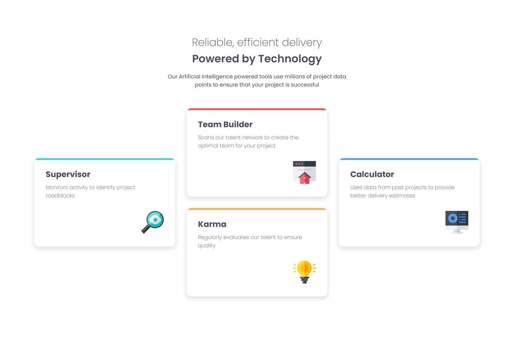

# Frontend Mentor - Four Card Feature Section Solution

This is my solution to the **Four Card Feature Section** challenge on Frontend Mentor. The objective of this project is to recreate a responsive feature section while practicing CSS layout techniques, responsive design, CSS Custom Properties, and SCSS.

## Preview



## Links

- **Live Site:** https://shrigel.github.io/four-card-feature-section/
- **Frontend Mentor Challenge:** https://www.frontendmentor.io/challenges/four-card-feature-section-weK1eFYK

## Built With

- Semantic HTML5
- CSS3
- SCSS / Sass
- Flexbox
- CSS Custom Properties
- Responsive Design
- Media Queries
- Google Fonts (Poppins)

## Layout

The original design was created for the following viewport widths:

- **Mobile:** 375px
- **Desktop:** 1440px

The feature section uses a responsive Flexbox layout. On smaller screens, the cards are displayed in a single column, while on larger screens they are arranged into the three-column layout from the original design.

## Style Guide

### Colors

#### Primary

| Color | HSL |
|--------|-----|
| Red | `hsl(0, 78%, 62%)` |
| Cyan | `hsl(180, 62%, 55%)` |
| Orange | `hsl(34, 97%, 64%)` |
| Blue | `hsl(212, 86%, 64%)` |

#### Neutral

| Color | HSL |
|--------|-----|
| Grey 500 | `hsl(234, 12%, 34%)` |
| Grey 400 | `hsl(212, 6%, 44%)` |
| White | `hsl(0, 0%, 100%)` |

### Typography

**Body Copy**

- Font size: **15px**

**Font**

- **Family:** [Poppins](https://fonts.google.com/specimen/Poppins)
- **Weights:** 200, 400, 600

## Project Structure

```text
├── images
│   ├── favicon-32x32.png
│   ├── icon-calculator.svg
│   ├── icon-karma.svg
│   ├── icon-supervisor.svg
│   ├── icon-team-builder.svg
│   └── preview.jpg
├── styling
│   ├── styles.css
│   ├── styles.css.map
│   └── styles.scss
├── index.html
└── README.md
```

## SCSS

The project uses **SCSS** as the primary stylesheet source.

The `styles.scss` file contains the source styles and is compiled into `styles.css`. The generated source map (`styles.css.map`) is included to make debugging the compiled CSS easier.

The project also uses CSS Custom Properties to manage colors and typography values:

```scss
:root {
    --red: hsl(0, 78%, 62%);
    --cyan: hsl(180, 62%, 55%);
    --orange: hsl(34, 97%, 64%);
    --blue: hsl(212, 86%, 64%);
}
```

Each card uses a custom `--accent-color` property to determine its accent color:

```scss
.cyan {
    --accent-color: var(--cyan);
}

.red {
    --accent-color: var(--red);
}

.orange {
    --accent-color: var(--orange);
}

.blue {
    --accent-color: var(--blue);
}
```

This allows the same `.card` component to be reused while changing only its accent color.

## What I Practiced

Through this project, I practiced:

- Building a responsive multi-card layout using Flexbox.
- Using SCSS nesting to organize component styles.
- Compiling SCSS into standard CSS.
- Managing a design system with CSS Custom Properties.
- Creating reusable components with modifier classes.
- Using pseudo-elements to create the colored card borders.
- Implementing responsive layouts with media queries.
- Structuring desktop and mobile layouts based on a provided design specification.
- Using generated source maps to support CSS debugging.

## Author

- GitHub - [@shrigel](https://github.com/shrigel)
- Frontend Mentor - [@shrigel](https://www.frontendmentor.io/profile/shrigel)
